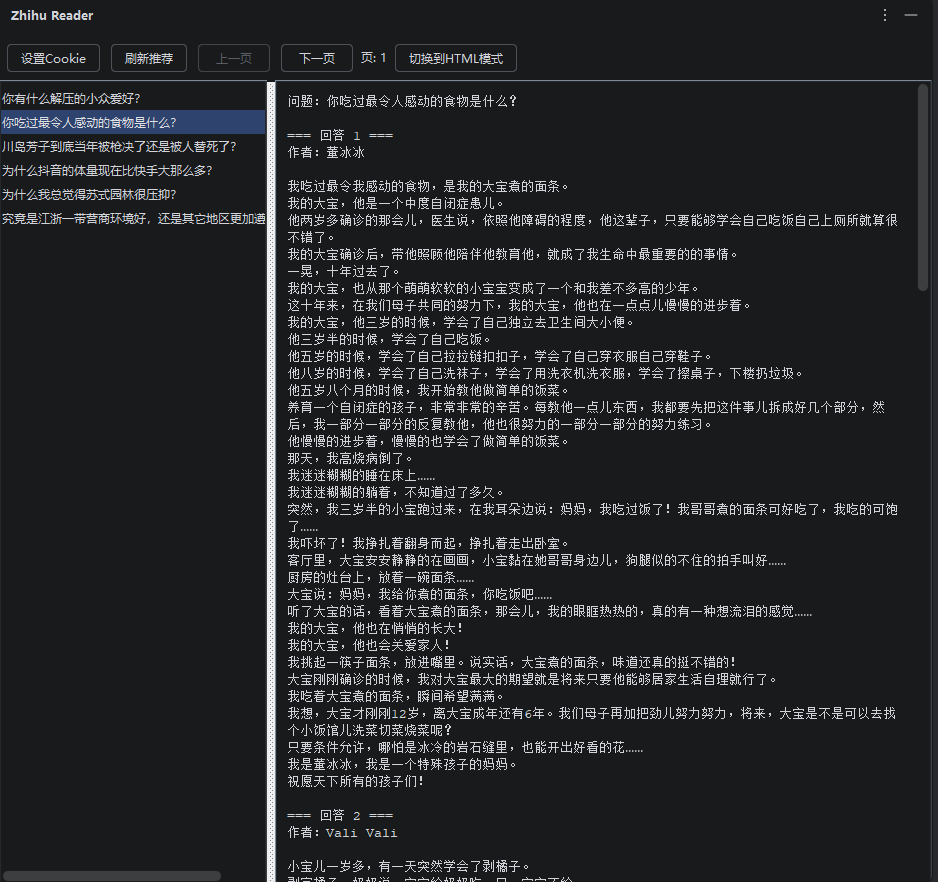
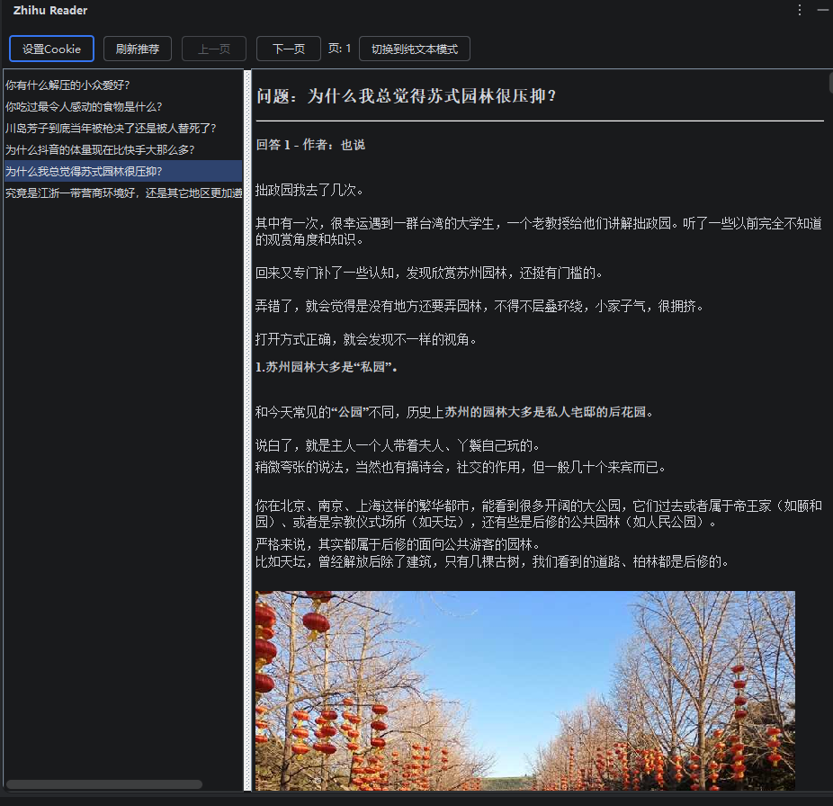

# Zhihu-Reader

## 介绍
<!-- Plugin description -->
To read Zhihu-related content in JetBrains, you need to first obtain the cookie from the page.

There are two modes: plain text mode and HTML mode. The HTML mode can display images, but some images may have parsing errors or size issues.

JetBrains 里阅读知乎相关内容，需要先从页面获取cookie。

有两种模式，纯文本模式和HTML模式，html模式可以显示图片，但是有些图片会解析错误或者大小有问题。
<!-- Plugin description end -->

### 纯文本模式

### HTML模式（能够显示图片）

## 下载

- 使用 IDE 内置插件系统：

  <kbd>Settings/Preferences</kbd> > <kbd>Plugins</kbd> > <kbd>Marketplace</kbd> > <kbd>搜索 "Zhihu-Reader"</kbd> >
  <kbd>Install</kbd>

---
基于 [IntelliJ Platform Plugin Template]的插件。

[template]: https://github.com/JetBrains/intellij-platform-plugin-template
[docs:plugin-description]: https://plugins.jetbrains.com/docs/intellij/plugin-user-experience.html#plugin-description-and-presentation
